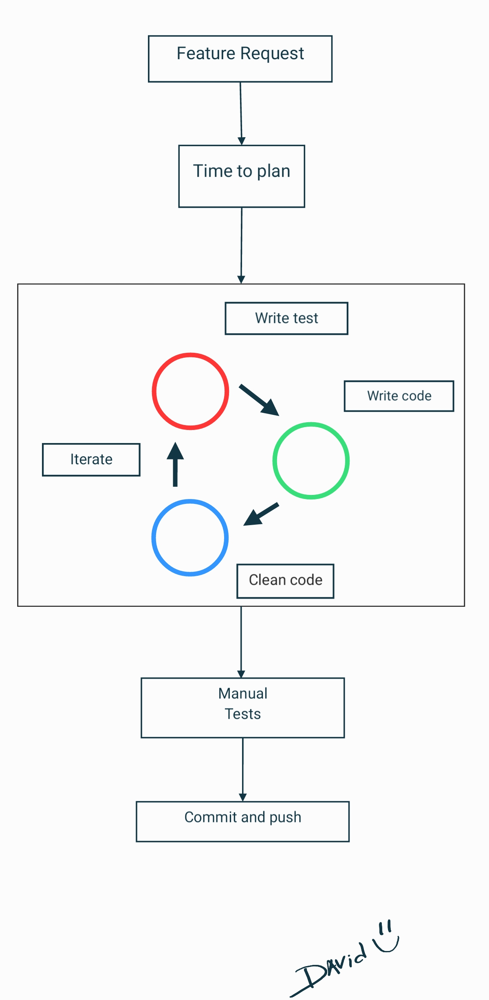

# Testing and Mocking with Laravel

Note: this post will be bigger and I'm writing more and fixing errors weekly.


## Why to write tests?
Before all, let's talk a little bit about the important of automatized tests in our work.

To be honest, I don't know how I lived before without this. I spent a long time testing the things manually, broking the old codes, etc. And, maybe the worst, thinking wrong.
I'll to explain.

When you do your test about something, you have the opportunity to really to think about the design of your real code, because you need do it simple, re-usable and with less dependences.

If you try do you test as TDD, making your test first and just after write your real code. Improving and testing again, it's so more easly do a refactor in 'task time', keeping less issues to the future.



Here, I'll put my personal good points about, why we need write tests:

* Help to do make good deliveries;
* Can to refactor without fear;
* Improve your code design - your test is the first 'customer' of your implementation;
* Improve your code design - you will to think better to make your code easily to be tested;
* If you to write one test for each new bug foun, maybe you never more will take the same bugs.

## Testing a RestFul API 

A simple way to test our REST API's and try keep safe some business contractor about attributes and API behavior is with Features tests.

I like most simple as possible and I'll show you some crud examples here!

### Testing creation of resources

For the simple cases, the main goal about the a creation of some resource is store the data inside our database, we can start with something like this:

```php
 public function testCreateTask()
 {
    $data = Task::factory()->make(); // using Factory to built a object of something

    $this->postJson('/tasks', $data->toArray()) // making a HTTP POST call with our task to create
        ->assertCreated(); // asserting if the HTTP response was correct 

    $this->assertDatabaseHas('tasks', $data->toArray()); // checking if the data was stored in database
}
```

Let's check some important points here:

* Use factory to deal with our resources;
* Asserting correct response of our call;
* Asserting if the data was stored in database.

It's really simple but power, of course we can improve this and also we need more tests to ensure complete our API cases.

### Testing validations in creation of resources

Usually we need to validate the data before try store in database, usually we do it with custom Requests or with basic Validators. In all cases, we can to delivery a status `422` if the data is not valid and also we can built some test to validate it:

```php
 public function testCreateTaskReturning422WhenDataWasInvalid()
 {
    $data = ['tite' => 'title of task with attribute name wrong'];

    $this->postJson('/tasks', $data) // making a HTTP POST call with our wrong task to create
        ->assertUnprocessable(); // asserting if the HTTP response is 422
}
```

It's really simple, we can improve this with validations of the response messages but this is a good start to ensure the basic of your validations.

### Testing retriving data -- TODO
### Testing updating data -- TODO
### Testing deleting data -- TODO

## Testing external services

Working with micro-services or external services integrated, sometimes we need to simulate the behavior of some resources, for example, HTTP calls. The mock is a way to simulate this and ensure the quality of your feature without to need the external resource inside your test.

Let's to say that you have a integration with Stripe Payments and you need to test your software but don't want to create a new customer or new billings every time when you run your tests. To do it, we need mock the Stripe behavior.

In my example, I'm using the Cashier to abstract the Stripe things, because this, I created a Service called PremiumService to abstract the Cashier functions and I mocked just the PremiumService.

To simplify our life, I like to create the mocks inside some Trait to just 'enable' inside my tests, like this:

```php
<?php

namespace Tests\Traits;

use App\Services\PremiumService;

trait StripeMock
{
    public function setStripeMock()
    {
        $this->mock(PremiumService::class, function ($mock) {
            $mock->shouldReceive('createAsStripeCustomer')->andReturn();
            $mock->shouldReceive('cancelProductSubscription')->andReturn();
            $mock->shouldReceive('createStripeSubscription')->andReturn($mock);
            $mock->shouldReceive('getActiveSubscriptions')->andReturn([
                ['id' => 12, 'name' => 'sub', 'items' => [['id' => 21]]],
            ]);
        })->makePartial();
    }
}
```

With this, inside my tests of stripe, I just need need import the Trait and run `$this->setStripeMock();` to 'enable' mock.

Let's to try understand the mock now.

In the first mock line `$this->mock(PremiumService::class, function ($mock)` we are creating the simulation of `PremiumService`, this way when the application initiate the Class, the mock will be used instead of real Class.


Inside of mock, we have defined the behavior about each method, like:
```php
$mock->shouldReceive('createAsStripeCustomer')->andReturn();
```

It means that when call the method `createAsStripeCustomer`, the return will be void as expected in real code. But if you check the `getActiveSubscriptions`, we have a simple data returning simulating the original behavior.


To clarify more, the PremiumService is just one Class to abstract the `Cashier` methods, like this:

```php
// PremiumService

public function getActiveSubscriptions(Company $company)
{
    return $company->subscriptions()->active()->get();
}

```
---

Here you can lean more about tests, I listed some good articles to help you:

https://ralphjsmit.com/laravel-mock-dependencies

https://5balloons.info/how-to-mock-objects-in-phpunit-pest-tests-in-laravel

https://medium.com/the-andela-way/mock-testing-in-laravel-4a2fe15885b8