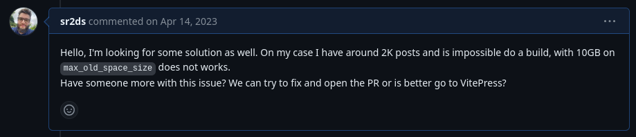
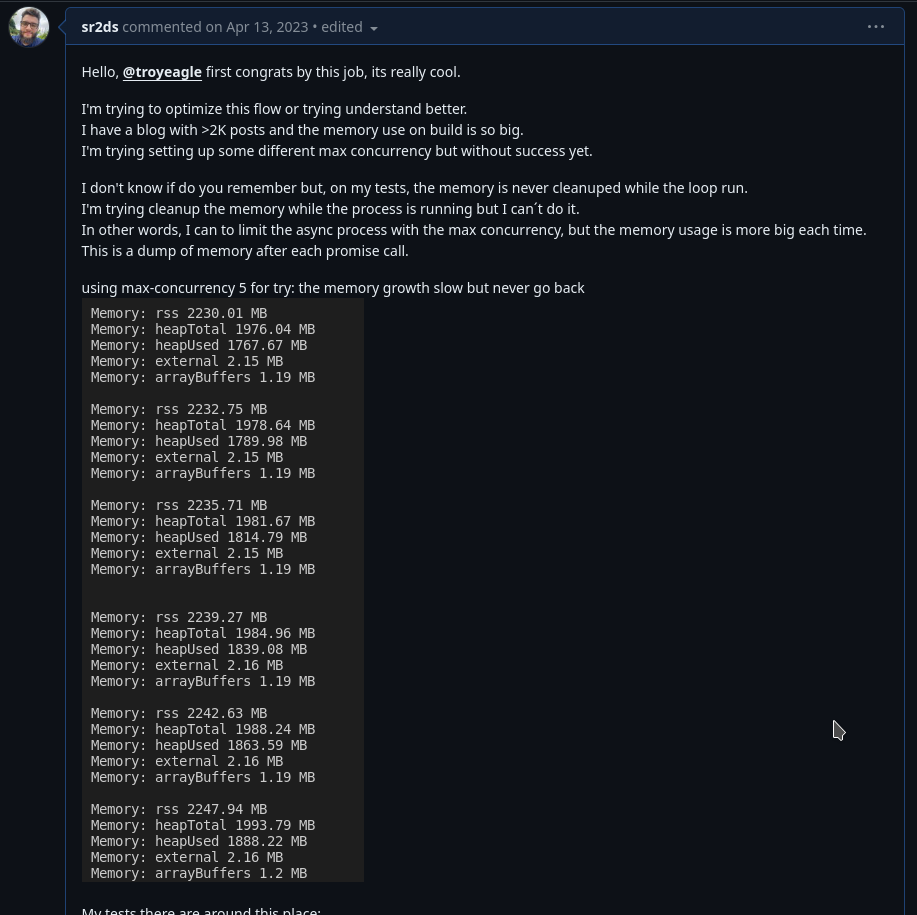
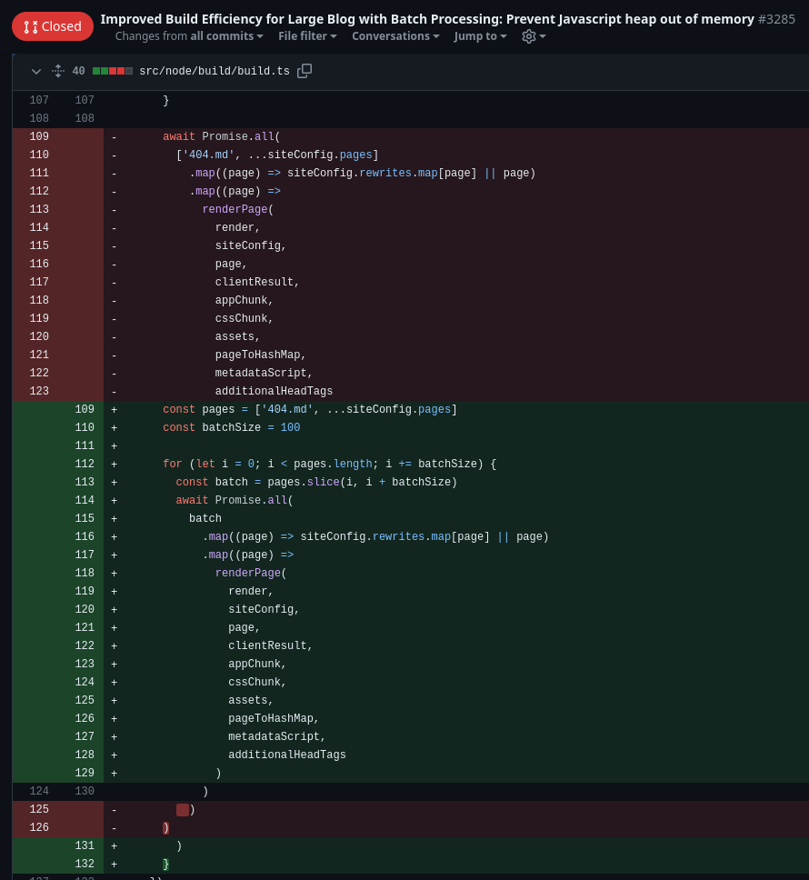
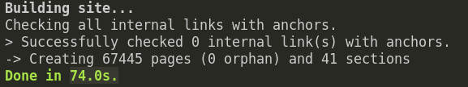

# Desafios e soluções na Gestão de blogs com +50 mil artigos - IA, Rust e Vue

Hoje vou falar um pouco sobre os desafios que eu passei ao escalar um site com muito conteúdo.

Isso tudo começa com WordPress, eu já trabalhei com WordPress há algum tempo, muitos bloguinhos e sites institucionais, coisas pequenas e com poucos acessos. WordPress é uma ferramenta super útil para construir blogs e mantê-los sem precisar de muito conhecimento técnico, ele tem lá seus problemas mas resolve o problema de muita gente e não vou falar mal dele aqui.

No meu caso, eu tenho criado blogs de conteúdos diversos já fazem alguns anos, comecei com WordPress. Quando a era da IA chegou, não foi diferente, eu incrementei o que eu já tinha e comecei outras coisas do zero.

Para contextualizar o momento atual disso, por muitos anos eu gastei vários trocados com hospedagens para tentar levantar blogs e eu estava cansado disso. Em determinado momento, eu comecei a migrar tudo de CMS's para conteúdos estáticos e hospedar tudo no GitHub Page e Netlify.

Até então eram coisas menores, digamos que no máximo 200 artigos cada blog. Quando a era IA chegou, eu já estava trabalhando com arquivos estáticos,
meus projetos estavam todos em VuePress, que é um excelente gerador de assets baseados em Vue.js.

## Knowledge-pill

Olha só como é valioso inventar coisas, mesmo que pareça que não dá retorno, sempre há algum retorno.

Toda essa brincadeira me deu algumas noções de SEO, Ads, tráfego, etc. Tudo isso foi muito legal, mas veja tecnicamente pontos interessantes que tive a oportunidade de fazer para tentar por em prática coisas da minha cabeça:

* Explorar ferramentas para sair do WordPress;
* Scripts de migrações entre plataformas;
* Construí integrações com Google Index API;
* Aprendi a analisar as coisas pensando no SEO e fazer acompanhamento de indexação;
* Integração com IA - OpenAi e Gemini;
* Criei um "framework" de criação de conteúdos em lote com multi-providers;

Tudo isso porque eu quis brincar e por algumas ideias da minha cabeça em prática.

Então a Knowledge-pill aqui é: Construa coisas que você acredita serem legais, mesmo que por diversão.

## VuePress

O VuePress nos permite construir os componentes em Vue (e eu gosto muito de Vue), porém, ele nos permite fazer um Build que nos entrega os arquivos estáticos pós-renderização. Então o processo de build se traduz em executar subir a instância do projeto e sair fazendo download de todas as páginas já renderizadas do site.

Isso funciona muito bem para sites menores, na verdade funcionou bem pra mim até uns 10 mil artigos.

### Por que VuePress?

O objetivo era não gastar com infra para hospedar os projetos e o VuePress me recebeu muito bem, primeiro pelo fato de eu ter experiência e gostar de Vue, segundo por que a documentação estava bem legal. Então é só por isso.

### Como foi a migração de WP para VuePress

O WordPress utiliza um banco de dados `MySQL`, enquanto que o VuePress tem sua base de dados no próprio código fonte do projeto, que são documentos no formato `Markdown`.

A migração não se trata apenas dos conteúdos dos posts, eu precisei adaptar algum layout do VuePress para ficar mais próximo ao que eu já tinha no WordPress. Por sorte, no meu caso, os meus layouts não fugiam muito de coisas básicas e rápidas para migrar, então não foi algo muito complexo.

Além do layout, é importante entender como é sua estrutura de URLs pois é muito muito ruim quebrar isso, então eu precisei encontrar uma forma de estruturar o novo projeto de forma que as URLs fossem exatamente iguais.

A migração dos conteúdos em si se trata de pegar os conteúdos de cada post, convertê-los para o formato markdown, incluir algumas notações necessárias em cada arquivo gerado e, claro, também não pode se esquecer das imagens.

Honestamente, eu não me recordo se eu fiz isso manualmente ou se encontrei alguma tool que facilitou parte do trabalho. Me lembro de ter encontrado algo que ajudava a converter de HTML para Markdown, mas não lembro se funcionou como previsto. Uma coisa é certa, foram vários detalhes que precisei fazer na mão além de só "converter" cada post. Mas fui conseguindo fazer pequenos scripts para me ajudar no decorrer do processo.

A migração foi relativamente simples, pelo que me lembro demorei alguns dias para entender todos os pontos e finalizar algumas migrações, sei lá, no máximo 15 dias e eu já tinha conseguido boa parte fazendo apenas nas minhas horas extras.

Listando pontos de atenção no trabalho de migração, eu diria:

* Estrutura de URLs;
* Layout com paginação - para estruturas de URLs personalizadas é preciso algum nível de customização;
* Estrutura do HTML gerado;
* Entender opções personalizadas do VuePress. ex: chunk de arquivos;
* Tempo de build e consumo de memória.

Um ponto a considerar, caso você não seja desenvolvedor e esteja lendo isso com intuito de fazer algo assim, há muitos processos manuais e para várias etapas eu preciso criar algum algoritmo para ajustar algo, não foi tão automático o processo. Para casos com poucos conteúdos, acredito que tudo bem fazer manualmente. Mas para blogs grandes, já fica mais complexo.

Há! No meu caso os projetos realmente são de conteúdos. Não tem nada dinâmico que precise de banco de dados ou alguma mágica de backend, têm uma coisa ou outra dinâmica mas consigo resolver tudo com `javascript` direto no front mesmo.

## O primeiro problema - Build comendo muita memória

Em Abril de 2023, eu comecei a ter dificuldades para fazer builds e fui em busca de [ajuda para comunidade](https://github.com/vuepress/core/issues/994):

Eu estava apenas com cerca de 2k artigos ainda mas as builds estavam rompendo o limite padrão no Netlify na época e eu fiquei preso nisso.

Pesquisei e testei algumas coisas, o debate é bem grande a respeito disso você pode ver no link acima.

Eu tentei algumas coisas, explorei um pouco o código fonte do `vuepress` e tentei contribuir com minhas descobertas nos debates que estavam rolando, tipo aqui: 

Nessa fase do projeto, eu parei de sofrer e aumentei os limites no Netlify para as builds funcionarem, mantendo ainda tudo free, apenas fazendo ajustes de configuração e deu tudo certo por um tempo. A única coisa errada era a build que estava demorando cada vez mais.

## O segundo problema - Build demorando muito

Estava tudo indo bem mas o processo de build estava demorando MUITO e o limite do plano free (300 minutos por mês) não estava dando conta mais. 

Lembre-se: O objetivo é manter FREEE. 

Então eu precisei mexer um pouco mais a fundo no código do vuepress para tentar entender se havia uma maneira de liberar a memória RAM presa em tempo de build. Foi então que eu entendi que o processo poderia ser melhor se fosse feito em lote.

Foi então que eu este [PullRequest para o VuePress](https://github.com/vuejs/vitepress/pull/3285/files), com uma mera mudança que fazia o processamento ser dividido em lotes, fazendo com a memória fosse liberada a cada lote executado. Isso definitivamente resolveu meu problema e ficou consideravelmente melhor. 

Meu Pull Request não foi aprovado, mas um outro cara fez um trabalho próximo da minha ideia de processar em lote mas usando o `pMap`. Que engraçado, eu desenvolvi com a premissa de não incluir dependência mas o PR aprovado foi bem com a lógica inversa kkk

Enfim, enquanto o PR de ninguém era aprovado, eu fui usando minha própria versão. Quando o PR do amigo foi aprovado, eu voltei para versão oficial.

## O quarto problema - Build demorando muito de novo e ainda comendo muita memória

Leve em consideração que os conteúdos são gerados por IA, então eu podia criar mil artigos por dia quando eu queria, então o processo de crescimento dos conteúdos estava sendo bem rápido.

A build voltou a demorar muito tempo e eu decidi mudar o processo de build para o Github Actions pois lá o tempo de build pode ser bem maior. Então eu estava fazendo a build no GitHub e publicando no Netlify apenas os assets já gerados, isso resolveu o problema e o projeto continuou a crescer.

## O quinto problema - Criei artigos demais?

Agora houve uma junção de problemas que, demorava MUITO e o processo de esvaziamento de memória já não era suficiente.

A Build rolava por 55 minutos e quebrava.

Na minha máquina, eu tenho 12 GB de memória RAM e uso Linux com XFCE, então se eu não abrir nada, eu tenho 10GB livres de boa, mas nem com meus 10GB de memória eu não conseguia fazer a build aqui.

Então o processo ficou muito complexo até para eu fazer debug disso, cansativo e minhas tentativas pareciam ineficientes. (PS mental: Se tá difícil é por que estudei pouco, preciso estudar mais).

Nesse momento eu parei de tentar e fiquei estudando e refletindo sobre as alternativas e sobre o processo de Build.

O problema do VuePress no meu contexto é que ele sobe o site e meio que faz download de página por página. Ele faz isso para aproveitar do conteúdo gerado com Vue e torná-lo estático. No meu caso, eu fazia pouco uso do Vue para que isso fosse necessário.

Com uma semana pensando nisso, eu considerei até em fazer um próprio builder que iria apenas usar um modelo de HTML padrão, pegar os Markdowns e criar manualmente cada página. Isso resolveria o problema.

Em algum momento veio um estalo: "Cara, vai ver o que tem em Rust pra isso, Rust é lindo e performa bem."

Foi aí que eu encontrei o [Zola](https://www.getzola.org/).

## Zola - 20 mil artigos

Essa frase me ganhou: "The average site will be generated in less than a second, including Sass compilation and syntax highlighting."

Zola é uma tool escrita em Rust que faz builds transformando um punhado de arquivos em sites estáticos.

Diferente do VuePress, o Zola faz exatamente o que eu pensei que precisava, apenas algo que criasse arquivos baseado em outros. Obviamente o processo de build seria mais econômico dessa forma e, com base na minha necessidade, serviria como uma luva.

Então lá vai eu testar, a migração tomaria alguns dias, então eu tinha que entender se isso era real. Então eu criei 20k arquivos iguais para testar o tempo de build e, ADVINHA, foi top. Eu sei lá, não lembro mais quanto tempo foi, mas foi coisa de 2 minutos no máximo.

Já estava muito melhor e provavelmente me permitiria escalar pelo menos umas 10x em número de publicações sem precisar me preocupar com isso.

Então comecei o processo de migração de VuePress para Zola.

A cereja do bolo são os markdowns, precisei fazer algumas mudanças nas notações de cada post, mas o conteúdo em si já estava de boa.

## Por que Zola?

Eu sou fã de Rust. Um único binário faz tudo. Resolveu o problema com maestria. E pronto, é isso.

### Como foi a migração de VuePress para Zola

O Zola usa um template engine chamado Tera, me senti trabalhando com `blade` do `Laravel` e faziam anos que eu não fazia isso, foi até legal.

Encontrei um layout bonito, fiz adaptações para ficar o mais favorável possível e layout ok.

A parte mais complexa foi conseguir entender como customizar o Zola para funcionar com base na minha estrutura de URLs `/yyyy/mm/dd/post-title`. Na documentação não está claro como fazer isso e eu vi alguns comentários na comunidade e no github dizendo que o Zola não dava suporte a isso.

Mas eu insisti, fiz algumas perguntas aqui, outra ali e juntando isso e alguns testes eu consegui chegar no mesmo padrão de URL. Bingo!

Diferente do VuePress que precisei programar a criação do `sitemap.xml`, o Zola já entregou isso pronto e até com a paginação necessária (1 sitemap a cada 50k links).

Eu diria que a migração para o Zola foi mais complexa do que a primeira migração, talvez por que o volume de posts está maior e lidar com isso ficou menos rápido.

Mas no geral eu consegui resolver em tempo legal para voltar a criar conteúdos. 

Deixei algumas melhorias para ir resolvendo depois e voltei a criar conteúdos.

Agora falando de performance, veja esta info da última build:

Inacreditável, né? Build de 67445 artigos em 74.0s.

### Componentes Vue

Como falei antes, eu queria um criador de HTML's, um conversor de markdown para HTML. Então, essa migração me fez perder algumas coisas que eu havia construído em VueJs, poucas coisas, mas precisei refatorar um componente específico.

O Vue é um framework completo que nos permite criar a aplicação de Frontend do zero dentro de uma estrutura própria, porém, também podemos usar o vue em formato embed dentro de qualquer site.

Ou seja, eu posso importar o vue de uma CDN e criar um componente ali mesmo, algumas coisas precisam ser alteradas e adaptadas, claro. Mas para meu caso, era apenas um componente que acessava uma API específica baseado no conteúdo do post e renderizava algo na tela em formato de oferta para o usuário. Eu poderia re-escrever tudo em javascript puro e fica de boa, mas eu considerei adaptar meu componente Vue e fazer o "embed" dele no novo layout. E pronto, eu consigo passar a info que eu quiser durante a Build para o HTML e, quando o usuário renderizar o site, o Vue entra em ação e renderiza meu conteúdo adicional. Vale lembrar que neste caso, meu conteúdo adicional não é requisito essencial no âmbito de indexação, então está tudo bem.

# 65 mil artigos e crescendo

Até agora o Zola está dando conta do recado, a build é feita no Netlify mesmo e têm demorado cerca de 5 minutos.

Eu suponho que eu vá conseguir chegar nos 500 mil artigos sem precisar mexer muito na estrutura atual, vamos ver.

No meio de tudo isso, eu fui melhorando meus scripts de migração e meu framework de criação em lote, melhorando com features e performance, isso é muito legal. Mesmo que só sirva pra mim e não é um projeto open-source ainda.

Chegamos ao fim, a ideia foi contar um pouco sobre como é criar e manter sites com muitos conteúdos, contar um pouco das minhas decisões estruturais para manter o projeto 100% free e compartilhar os desafios. E se você tiver curioso para saber qual é o site em questão, vai continuar curioso por enquanto kkkk Eu não gosto muito de expor as coisas, mas o conhecimento é crucial que seja compartilhada, por isso eu escrevi o artigo com detalhes tecnicos.

Se você é desenvolvedor e veio aqui com a intenção de sair com um conhecimento específico, leve com você o pensamento de que construir coisas por nós mesmos nos fazem aprender muito.

Então se tiver alguma ideia que possa impulsionar seus conhecimentos de alguma forma, faça. 

Se você está em busca de aprendizado, não interessa se ninguém vai usar ou ninguém vai considerar útil seu projeto, só o fato de ir aprendendo a resolver os problemas que você mesmo criar, vai te dar know-how para os projetos profissionais e te colocar a frente de quem não fez nada ;)

Até mais!
