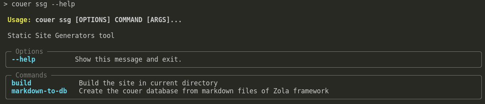

# Dump Mental 2 - Meu projeto para SSG

PS: Este texto é mais um dump mental, não é um artigo técnico, não espere coerência o tempo todo, tão pouco quaisquer ensinamentos. Alias, espere grandes devaneios e brisas.
Se você está por fora de tudo, leia o primeiro post para começar a entender como cheguei aqui: [Desafios e soluções na Gestão de blogs com +50 mil artigos - IA, Rust e Vue](/posts/2024/PT-desafios-e-solucoes-na-gestao-de-blogs-com-mais-de-50-mil-artigos-ia-rust-e-vue.html)

Desde o último post, que foi dia 10/04/2024, se passaram 19 dias. No dia em que eu o escrevi, eu estava tentando analisar se valeria a pena escrever uma solução para ter mais controle sobre meus blogs (aos quais essa série de posts se refere) e de lá pra cá eu analisei, planejei e iniciei.

Depois de alguns dias planejando e entendendo quais features eram essenciais, como fazer, modelagens, etc. Eu comecei o projeto.

Seguindo a simples premissa inicial de "Fazer build do meu blog sem gastar mais de 10gb de memória RAM.", hoje eu conclui a primeira etapa e posso dizer que consegui. Usando como modelo um blog com exatos 63338 artigos + 634 páginas que listam os artigos de 100 em 100, eu consegui chegar no seguinte benchmark:

```
Duration: 0:03:32.766377
Debug: RSS: 194.05 MB | VMS: 462.56 MB | Data: 213.73 MB | USS: 181.77 MB | PSS: 182.84 MB | Processed: 63338 | Uso da CPU: 103.40%
```

Este é o print do final do processo, o uso de memória e CPU obviamente variou no decorrer da execução mas não passou muito de 230mb em rss.

Não sou especialista em analise de consumo de memória, mas estou considerando o uso do `RSS` (Resident Set Size) pois, pelo que entendi, é o que o meu processo "comeu" da memória física.

É interessantíssimo ter esse controle, eu posso tentar bater um tempo menor que os 3 minutos que estou gastando se eu considerar ok gastar mais memória RAM e/ou incluir mais threads para os processos assíncronos. Um exemplo legal é que, se eu parar de fazer os processos assincronos eu consigo economizar bastante memória RAM pois só o fato de disparar as threads já aumentam o consumo. Pensando nisso, se meu objetivo é economia de memória, preciso analisar bem se realmente é viável o uso de threads em alguns cenários, por hora está legal como está, mas pode ser melhor.

Para um trabalho de menos de um mês e apenas nas horas vagas, está bom assim por agora. Já resolverá meu problema real.

Estou fazendo tudo isso em `python` e é engraçado pensar que talvez eu alcance uma performance melhor do que a do `Zola` que é feito em `Rust`. Mas é isso, as vezes tem mais haver com a arquitetura que foi pensada do que com a linguagem. Pelo fato do meu projeto já estar nascendo com essa premissa e em um cenário maior do que blogs comuns, eu posso tomar algumas decisões voltadas para essa necessidade. Então, mesmo que eu cometa alguns erros de arquitetura e modelagem, pelo fato de eu estar a todo momento analisando minhas entregas com foco em otimização, eu consigo fazer alguns bons acertos. Claro que não é nem justo comparar, o `Zola` é incrível e a comunidade é muito legal também, meu objetivo nem é ter as mesmas features, só quero resolver os problemas que tenho nos meus cenários e estou tendo a chance de aprender um pouco mais a cada fase.

Como por exemplo minha decisão de sair dos arquivos `.md` e colocar tudo dentro do `sqlite`, isso me dá o poder de paginar e iterar de forma bem simpes e ainda poderei fazer a administração dos dados em algum painel como um `sqladmin` da vida, embutido no meu projeto. Há um ponto meio crítico em relação a isso que é o fato do meu arquivo `sqlite` já ocupar mais de 200mb de armazenamento, isso faz com que seja necessário criar um repositório `git` diferente para lidar com arquivos maiores, não que seja um problema, mas é importante saber. Ainda estou pensando nisso e em algumas abordagens, por exemplo, eu poderia tentar quebrar em mais arquivos de `sqlite` para não bater esses limites, sei lá. Eu também poderia manter os `markdowns` e só usar o `sqlite` como algo temporário para me ajudar nas builds, não sei, vamos ver em breve.

Vamos falar um pouco da experiência de modelar tudo isso e ir desenvolvendo as features.

Eu considerei que vou migrar e desenvolver mais ferramentas do que só o gerador de sites estáticos, vou migrar outras ferramentas que eu tenho para dentro desse framework, por conta disso eu busquei alguma solução escalável em termos de código para ir incluindo novos módulos de maneira simples, então, pensando agora criei novas premissas já no inicio para ficar organizado:

1. Usar um sistema de módulos;
2. Pacote pip:
    2.1. Poder importar os módulos em outras aplicações;
    2.1. Poder usar os comandos via CLI

Isso significa que o projeto pode ser usado assim direto no terminal:
```sh
$ projeto-name {modulo} {parametros}
```

Ah, essa foto pode explicar melhor:



E também poderá ser importado em outro projeto python:
```python
from projeto-name import modulo
```

Para que tudo isso funcione, eu iniciei o projeto fazendo o setup do `poetry` com o `typer` dentro, e ficou muito maneiro.

Feito isso, eu pude começar a desenvolver o primeiro módulo que chamei de `ssg` com dois simples comandos `markdown-to-db` e `build`. Como os nomes já explicam, o primeiro comando vai iterar em todos os posts que tenho no formato do `Zola` framework e colocar dentro do `sqlite` do projeto. E o segundo comando vai iterar sobre os artigos do `sqlite`, criando todas as publicações, paginações e sitemaps. E tudo isso está funcionando lindo! 

Esse lance de modularizar via CLI é muito legal mesmo, eu já tinha feito algo em `Node` no passado mas foi a primeira vez fazendo algo assim em `python` e gostei.

Além disso, logo que terminei de organizar isso e iniciei o módulo `ssg`, precisei estudar um pouco e conhecer as ferramentas de template engine para escolher alguma que fosse amigável para meu projeto. Optei pelo `jinja2`, é bem poderoso e a documentação é legal, baseado no que eu preciso ele está atendendo muito bem e gostei da performance. Por hora ele está legal.

Inclusive, falando de templates, consegui reaproveitar até que bem meu template atual que foi feito para o `Zola`, claro que precisei fazer algumas adaptações, até por que vou manter esse template como o template base da ferramenta, mas foi bem tranquilo fazer isso.

Já modelei o sistema para aceitar templates customizados, então se o blog não tiver uma pasta `templates` dentro dele, o template padrão vai ser utilizado. Preciso fazer algumas melhorias em relação a isso, até para ficar mais fácil criar os próximos templates, mas por hora vou avançar com o template base em mente.

Tenho uma série de melhorias para fazer e deixar tudo mais amigável, mas estou focado em tentar ter um equilibrio nesse primeiro módulo pois preciso virar a chave e começar a migrar meus blogs para esse novo projeto, então estou equilibrando entre otimizar de mais e entregar os recursos.

Caramba, já parou para pensar que expor suas ideias em tempo real de forma coesa é quase que uma arte?
É relativamente complexo mas extremamente subestimado, tirar as ideias da cabeça e escreve-las de maneira que alguém possa compreender, é necessário uma organização do fluxo mental para isso e também um tanto de paciência.
Em outras palavras, preciso manter esse ritmo para aprimorar essa habilidade, isso me ajuda a organizar os pensamentos e expor minhas idéias.

Então finalizando, o meu framework/cli/toolkit/sei-la já está fazendo a build do meu site de forma aceitável. Tenho alguns pequenas features planejadas para poder dizer que finalizei o módulo de `ssg` e partir para o próximo.
Alias, se você ficou perdido, o módulo `ssg` é o recurso responsável por construir sites. `SSG` significa em português "Gerador de Sites Estáticos" e eu digo que é um módulo pois terão outros módulos responsáveis por outras coisas que eu preciso para fazer a gestão dos meus projetos relacionados a isso.

Então, ainda faltam algumas coisas no `ssg` mas também e principalmente muita analise no resultado gerado, pois há todo um trabalho necessário para que os projetos sejam indexados adequadamente e eu preciso analisar muito bem antes de virar a chave, para garantir que eu não perca indexações e acessos que eu já tenho nos projetos.

E é isso isso por hora! Valeu :) 
